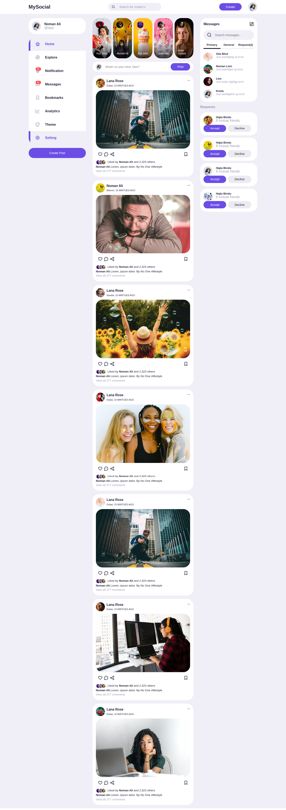

# Social Media Application that Build with HTML/CSS and JavaScript 

This is project that build with HTML/CSS JavaScript, In this project you can change the theme setting color and font size like small and Bigger font, this is responsive Website use Media Queries.

## Funcationality

 - Mobile Responsive
 - Text Resizing
 - Theme Customization

## Authors

- [@nomankhokhar](https://www.github.com/nomankhokhar)

## Badges

## 🚀 About Me

I'm a Engineer...